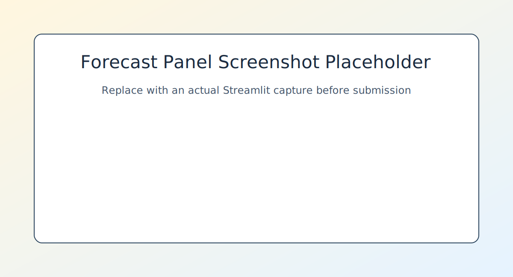
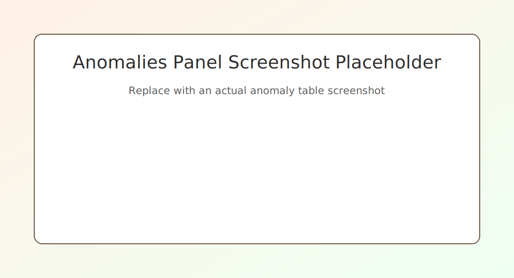
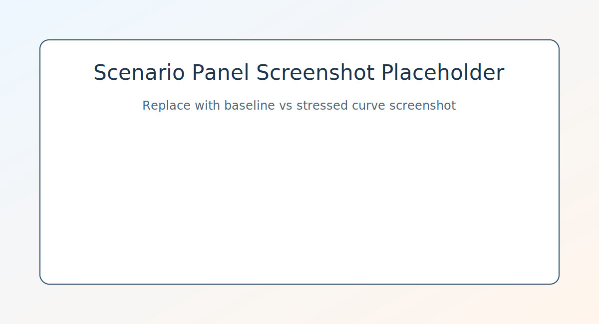

# Segment Delinquency Forecasting Dashboard

## Overview
This project is a credit-risk analytics app designed for a NatWest-style lending context where segment-level delinquency needs close monitoring. It forecasts short-horizon delinquency, detects unusual repayment stress, and simulates how default risk changes when interest rates rise. The focus is practical explainability: each output can be shown to non-technical stakeholders such as portfolio managers or risk committees.

## Features
- Short-horizon delinquency forecasting (4-6 weeks mapped to 1-2 monthly periods)
- Explainable baseline and SARIMAX forecasting per segment
- Prediction intervals (80% default) for uncertainty bands
- Anomaly detection when actual delinquency falls outside forecast bands
- Scenario stress testing under interest-rate shocks (for example +0.5%)
- Streamlit dashboard with charts, anomalies table, and manager-friendly summary text
- Optional Gemini-generated natural-language summary if API key is set

## Repository Layout
project/
  src/
    data_loader.py
    forecasting.py
    anomalies.py
    scenarios.py
    evaluation.py
    streamlit_app.py
  tests/
    test_pipeline.py
    test_evaluation.py
  assets/
    sample_dataset.csv
  README.md
  requirements.txt
  .env.example

## Setup
1. Create and activate a virtual environment.
2. Install dependencies:

   pip install -r requirements.txt

3. Run the Streamlit app:

   streamlit run src/streamlit_app.py

4. Optional: set environment variables from .env.example (for Gemini summaries).

## Data Format
Input rows are expected at segment-month granularity with these required columns:
- date (month-end date)
- segment_id
- repayment_rate (0 to 1)
- delinquency_rate (0 to 1)
- income_to_debt_ratio
- avg_interest_rate

Optional macro columns currently supported:
- unemployment_rate
- gdp_growth

## Usage Examples
### 1) Dashboard flow
- Open the app with sample data or upload your own CSV.
- Choose a customer segment from the dropdown.
- Adjust horizon and interest-rate shock in the sidebar.
- Review forecast band, anomaly table, and stressed scenario curve.

### 2) Backtesting from CLI
Run rolling-origin evaluation over all segments:

python -m src.evaluation --input assets/sample_dataset.csv --test-periods 6 --risk-threshold 0.08

### 3) Screenshots (replace with your own captures)

## Model Notes
### Forecasting
- Baseline: Simple Exponential Smoothing (with rolling-mean fallback).
- Main model: SARIMAX(1,0,0), optionally using exogenous variables such as income_to_debt_ratio and avg_interest_rate.

### Uncertainty Bands
- Forecast intervals come from model confidence intervals.
- If model fitting fails, baseline forecasts are used with a residual-spread heuristic to form bands.

### Anomaly Detection
- In a recent test window, one-step forecasts are generated using rolling-origin evaluation.
- A point is flagged when:
  - actual > upper_band + margin (high anomaly), or
  - actual < lower_band - margin (low anomaly)
- Driver hints compare current feature levels versus recent averages.

### Interest-Rate Scenario Stress Test
- Primary approach: linear regression sensitivity on delinquency using
  avg_interest_rate, income_to_debt_ratio, repayment_rate, and optional macro features.
- Stress simulation: apply +delta to avg_interest_rate and adjust the time-series forecast by predicted regression uplift.
- Fallback approach: elasticity scaling,
  stressed = baseline x (1 + elasticity x delta_rate).

## Evaluation
The evaluation module runs rolling-origin backtests per segment and reports:
- Forecast metrics vs naive and rolling baselines: MAE, RMSE, MAPE
- Classification-style checks for high-delinquency alerts: ROC-AUC and confusion matrix

## Optional LLM Summary
If GEMINI_API_KEY is set, the app attempts to produce a plain-language summary for non-technical managers. Without a key, it uses a deterministic template summary.

## Notes for Hackathon Judges
- The app intentionally uses explainable and auditable methods over opaque black-box modeling.
- Every output panel maps directly to an operational risk workflow: forecast, alert, stress test, and explain.
