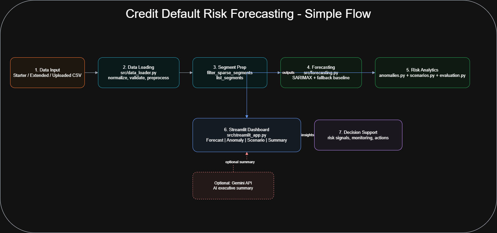

# Credit Default Risk Forecasting

Segment-level credit delinquency forecasting, anomaly monitoring, and rate-shock scenario analysis in an interactive Streamlit dashboard.

## Overview

This project helps risk teams monitor early signs of credit stress by combining:

- short-horizon delinquency forecasting
- anomaly detection against forecast bands
- interest-rate stress simulation
- segment-level backtesting metrics

The app is designed for explainability and practical decision support rather than black-box modeling.

## What It Does

- Forecasts delinquency rates using SARIMAX with fallback baseline logic
- Produces 80% prediction intervals
- Flags anomalies in recent periods with configurable margins
- Simulates default pressure under interest-rate shocks
- Calculates backtesting metrics (MAE, RMSE, MAPE, ROC-AUC, confusion matrix)
- Displays everything in a four-tab Streamlit UI:
  - Forecast View
  - Anomaly Monitor
  - Scenario Lab
  - Executive Summary

## Project Structure

```text
assets/
  architecture.png
  sample_dataset.csv
  demo_dataset_extended.csv
src/
  streamlit_app.py
  data_loader.py
  forecasting.py
  anomalies.py
  scenarios.py
  evaluation.py
tests/
  test_pipeline.py
  test_evaluation.py
  test_upload_resilience.py
project_architecture.drawio
requirements.txt
README.md
```

## Architecture

### Visual Architecture



### Editable Diagram

- Draw.io file: project_architecture.drawio

### Data Flow

1. Load data from starter sample, extended sample, or uploaded CSV
2. Normalize headers, coerce data types, validate required columns
3. Filter sparse segments and select segment in the UI
4. Forecast delinquency with SARIMAX (or baseline fallback)
5. Detect anomalies via rolling-origin forecast checks
6. Run interest-rate stress scenario
7. Render dashboard outputs and summary metrics

## Installation

### Prerequisites

- Python 3.9+
- pip

### Setup

```bash
git clone https://github.com/shubhtiwari65/Credit-Default-Risk-Forecasting.git
cd Credit-Default-Risk-Forecasting

python -m venv venv
# Windows PowerShell
venv\Scripts\Activate.ps1
# macOS/Linux
# source venv/bin/activate

pip install -r requirements.txt
```

## Run the App

```bash
python -m streamlit run src/streamlit_app.py
```

Open: http://localhost:8501

## Evaluate from CLI

```bash
python -m src.evaluation --input assets/sample_dataset.csv --test-periods 6 --risk-threshold 0.08
```

## Run Tests

```bash
pytest -q
```

## Input Schema

Required columns:

- date
- segment_id
- repayment_rate
- delinquency_rate
- income_to_debt_ratio
- avg_interest_rate

Optional columns used when available:

- unemployment_rate
- gdp_growth

Notes:

- rate fields can be provided as percentages (for example, 5.2%) or 0-1 decimals
- dates are normalized to month-end timestamps

## Tech Stack

- Streamlit
- Pandas, NumPy
- Statsmodels
- Scikit-learn
- Plotly
- Pytest
- Google Generative AI (optional summary generation)

## Current Limitations

- Forecast horizon is short-term (configured through week-to-month mapping)
- Sparse segments are excluded by minimum-observation filtering
- SARIMAX order is fixed to a simple specification in current implementation
- Scenario engine is linear and intended for stress sensitivity, not causal inference

## Notes on AI Summary

- Executive summary generation has a safe fallback text path
- If external AI call fails, the app still returns a deterministic summary
- The repository includes .env.example for optional environment-based setup

## License

This project is released under the Apache License 2.0. See LICENSE.

## Support

- Issues: https://github.com/shubhtiwari65/Credit-Default-Risk-Forecasting/issues
- Email: shubhtiwari651@gmail.com
